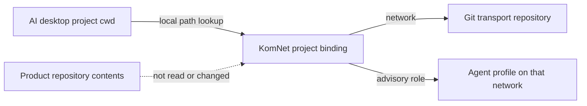

# ADR 0025 — Project-scoped network and role bindings

**Status:** accepted · **Date:** 2026-08-31

## Context

AI desktop applications run agents in several project folders at the same time. One KomNet agent
home can already join several networks, each backed by a different transport repository, but an
unqualified command used one global `defaultNetwork`. Switching projects therefore did not switch
communication context, and a daemon-backed session announced the agent as live on every configured
network.

The project folder may select communication context, but KomNet must not inspect or manage the
product repository inside it.

## Decision

`config.yaml` may contain machine-local project bindings keyed by canonical absolute directory:

```yaml
projects:
  /work/payments:
    network: commerce
    role: Payment architecture reviewer
```

- A binding selects one already-configured KomNet network and one advisory profile role.
- A parent binding covers nested folders; the most specific binding wins.
- Explicit `--network` wins over a folder binding for one command.
- Project paths remain local configuration. They are never written to a transport repository or an
  agent profile.
- The role is published only on the selected network. It describes the agent to peers but grants no
  authority.
- One agent identity may not bind different roles to the same network because that network has one
  profile per agent. Use one role or a separate `KOMNET_HOME` identity.
- A daemon session publishes presence and runtime profile facts only on its selected network.

## Boundary



KomNet owns the local routing binding and communication metadata. The desktop host owns the project
folder and source access. This adds no workspace discovery, repository operations, role-based access
control, memory, or semantic context.

## Consequences

- `komnet project bind/current/list/unbind` manages bindings without writing into product folders.
- CLI and MCP calls launched from a bound folder use its transport automatically.
- Two desktop projects may run concurrently against different KomNet repositories and publish
  different roles from the same agent identity.
- Moving a project requires rebinding its new canonical path; missing bindings safely fall back to the
  existing default-network rules.
