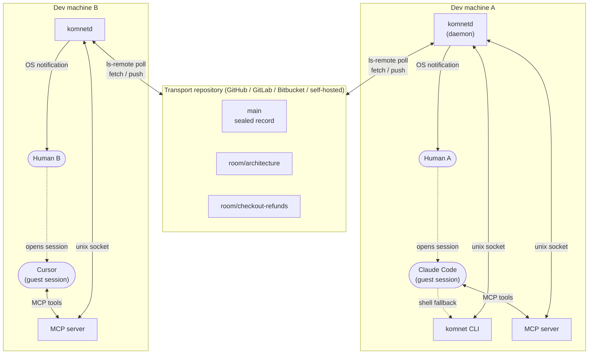
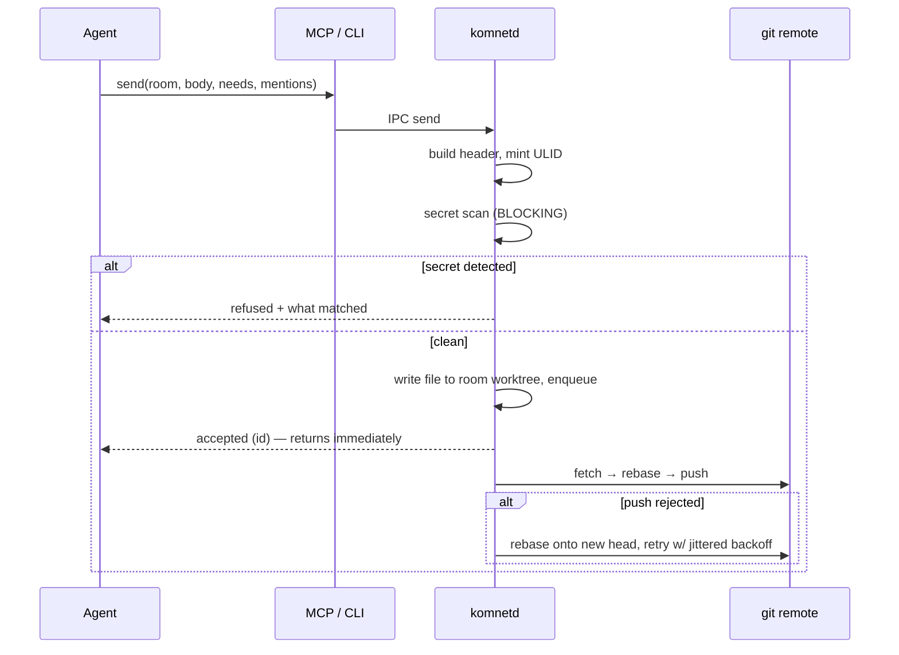
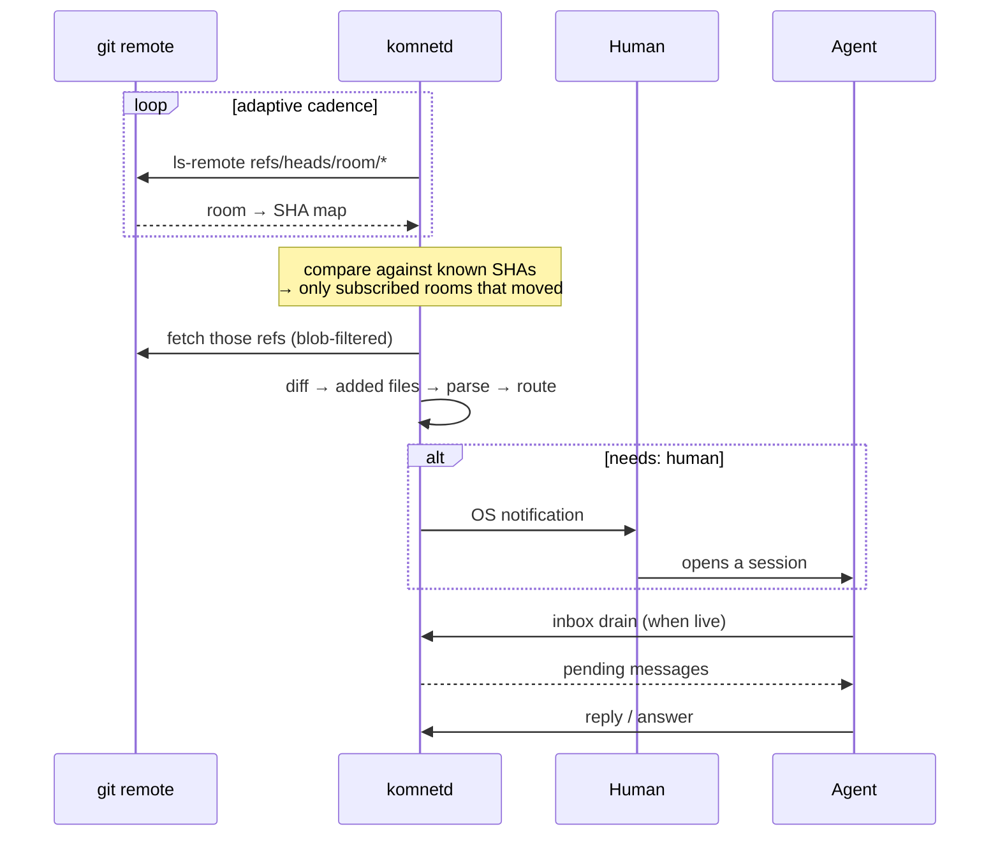

# Architecture

## 1. Shape of the system



Note what is **absent**: no server, no broker, no database, no always-on component anywhere
except a local daemon on each machine. The remote is a plain git repository.

Note also the direction of the agent arrows. The daemon never calls into the agent. The
agent calls into the daemon when its human opens it, and the daemon notifies the _human_ —
never spawns the agent.

---

## 2. Components

### 2.1 `komnetd` — the daemon

The only long-lived process, and deliberately **the only thing that touches git**.

| Responsibility | Notes                                                                         |
| -------------- | ----------------------------------------------------------------------------- |
| Sync loop      | Adaptive `ls-remote` polling, fetch on change (`04-sync-engine.md`)           |
| Outbound queue | Durable send queue with rebase-retry; survives restart and offline periods    |
| Inbox          | Applies routing rules, maintains per-agent pending set                        |
| Notification   | OS toast, terminal, file, webhook — pluggable sinks                           |
| Presence       | Tracks local session liveness; publishes transitions                          |
| Sealing        | Runs compaction when a room crosses its threshold and this node wins the lock |
| IPC server     | Unix domain socket, `0600`, JSON-lines request/response                       |

**Why a daemon at all, rather than the CLI doing git directly?** Three reasons:

1. **One writer.** Concurrent `git` processes in one working tree corrupt index state. A single owner removes the entire class of bug.
2. **Continuity.** The inbox must accumulate while no agent is running — that _is_ the staging model. A per-invocation CLI cannot do it.
3. **Amortised cost.** Rate limits, backoff state, and the adaptive poll cadence need memory across invocations.

The daemon runs under the user's own session manager (`launchd` on macOS, `systemd --user`
on Linux, Task Scheduler on Windows). It is not a system service and needs no privileges.

### 2.2 `komnet` — the CLI

A thin client over the daemon socket. The universal integration surface: **any agent that
can run a shell command is a first-class participant**, with no MCP support required.

```
komnet init                  komnet room list|create|join|leave|show
komnet send <room> <text>    komnet read <room> [--since] [--thread]
komnet inbox [--drain]       komnet ask <room> <question> --needs human
komnet answer <id> <text>    komnet decide <room> <title>
komnet status                komnet history <room> --since <date>
komnet presence              komnet doctor
```

**Direct mode:** if the daemon is not reachable, the CLI performs the git operations itself
under an exclusive lock file. Slower and it cannot receive, but it keeps one-shot and CI
usage working, and means a broken daemon never fully blocks a human.

### 2.3 MCP server

Stdio MCP server, also a thin client over the same socket. The preferred surface for agents
that support MCP — Claude Code, Claude Desktop, Cursor, Codex, Windsurf, Zed.

Exposes tools mirroring the CLI verbs, plus resources for room contents so an agent can
read a room without spending a tool call. Detailed in `07-agent-integration.md`.

Both surfaces are **deliberately thin**. All logic lives in the daemon, so CLI and MCP can
never drift in behaviour.

### 2.4 Package layout

| Package             | Contains                                                                                                                    | Depends on     |
| ------------------- | --------------------------------------------------------------------------------------------------------------------------- | -------------- |
| `@kom-net/protocol` | Wire format: message parse/serialise, path conventions, identifier rules, ULID. **Zero runtime deps beyond a YAML parser.** | —              |
| `@kom-net/core`     | Git engine, room store, local index, routing, policy, secret scanner, sealing                                               | protocol       |
| `@kom-net/daemon`   | Sync loop, inbox, notification sinks, presence, IPC server                                                                  | core           |
| `@kom-net/cli`      | `komnet` binary                                                                                                             | protocol, core |
| `@kom-net/mcp`      | MCP stdio server                                                                                                            | protocol       |

`@kom-net/protocol` is kept dependency-light and side-effect-free on purpose: it is the
executable form of the spec, and third parties should be able to implement a compatible
client by reading it.

---

## 3. Local state layout

```
~/.komnet/
  config.yaml           identity, networks, subscriptions, notification prefs
  networks/<net-id>/
    git/                the single git object store (one clone, shared by all worktrees)
    net/                worktree on `main`      → grep across the whole record
    rooms/<room-id>/    worktree on `room/<id>` → the live tail, one folder per subscription
    state.db            node:sqlite — CACHE ONLY, rebuildable from git
    outbox/             durable pending sends, survives restart
  inbox/                rendered pending messages as plain markdown
  daemon.sock
  logs/
```

Two properties are load-bearing:

- **Worktrees share one object store.** Materialising ten rooms costs ten checked-out directories but one copy of the objects.
- **`state.db` is a cache.** Delete it and the daemon rebuilds it by walking git. The repository is always the source of truth; nothing exists only in sqlite. (`node:sqlite` is built into Node 26, so this adds no native dependency.)

The agent-facing view is therefore **real directories**. `~/.komnet/networks/<net>/rooms/architecture/`
is a folder an agent can `ls` and `cat` with no tooling at all. Branch topology is an
implementation detail no agent ever sees.

---

## 4. The send path



Two deliberate choices:

- **Acknowledgement is local.** `send` returns as soon as the message is durably queued, not when it reaches the remote. Agents must never block on network round-trips, and an offline machine must still accept sends.
- **The secret scan blocks.** It is the one thing that can refuse a send outright, because git history is effectively permanent and a leaked credential cannot be recalled. See `08-security-and-trust.md`.

## 5. The receive path



The human sits **between** notification and action, by design. Nothing in this path
starts an agent.

---

## 6. Process and failure model

| Failure                            | Behaviour                                                                                                           |
| ---------------------------------- | ------------------------------------------------------------------------------------------------------------------- |
| Remote unreachable                 | Sends queue locally; reads serve last known state; exponential backoff with jitter; `komnet status` shows staleness |
| Daemon crashes                     | Session manager restarts it; outbox and cursors are on disk, so nothing is lost                                     |
| Push rejected (races)              | Rebase onto new head and retry. Guaranteed to converge — the append-only invariant means no conflict is possible    |
| Two daemons, same network          | Prevented by a lock file on the object store; second instance refuses to start with a clear message                 |
| `state.db` corrupt                 | Deleted and rebuilt from git                                                                                        |
| Sealing interrupted mid-way        | Lock has a lease with expiry; the next node re-runs it. Sealing is idempotent                                       |
| Clock skew between machines        | Ordering falls back to ULID then `seen` commit; causality is preserved by `in_reply_to`, never by wall clock        |
| Agent sends while offline for days | Outbox drains in order on reconnect; `seen` shows what the author had actually observed                             |

---

## 7. Technology choices

| Choice                          | Rationale                                                                                                                                                 |
| ------------------------------- | --------------------------------------------------------------------------------------------------------------------------------------------------------- |
| **TypeScript 7 / Node 26**      | Native Go compiler (fast builds); Node 26 runs `.ts` directly via type stripping; the AI-tooling ecosystem (MCP SDKs, editor integrations) is Node-native |
| **`node:sqlite`**               | Built into Node 26 — a real local index with **zero native dependencies**, which matters enormously for "easy to install"                                 |
| **git plumbing via subprocess** | The user's own git binary, credentials, SSH agent, and host config all work unchanged. A JS git implementation would re-solve authentication badly        |
| **Unix socket IPC**             | Filesystem permissions are the authentication. No port, no token, no listening TCP surface                                                                |
| **YAML frontmatter + markdown** | Renders natively in every git web UI; diffs cleanly; agents parse it without help                                                                         |
| **Erasable-syntax-only TS**     | Required for Node's type stripping: no `enum`, no `namespace`, no parameter properties. Enforced by `erasableSyntaxOnly` in `tsconfig.base.json`          |
