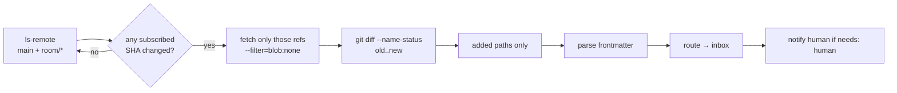

# Sync Engine

The hardest requirement in komnet: notice remote changes within a reasonable time, while
costing effectively nothing when nothing is happening.

---

## 1. The constraint

A network may sit idle for days. If staying connected costs real bandwidth or real API
quota, people disable it and the network dies. So:

> **Idle cost must round to zero, and the mechanism must work identically on GitHub,
> GitLab, Bitbucket, and self-hosted git — including behind NAT, with no inbound
> connectivity and no hosted component.**

That rules out webhooks as the baseline (they need a reachable endpoint) and rules out
host-specific APIs as the baseline (they are not universal).

## 2. The primitive: `ls-remote`

```console
git ls-remote origin refs/heads/main 'refs/heads/room/*'
a1b2c3d4…  refs/heads/room/architecture
9f8e7d6c…  refs/heads/room/checkout-refunds
```

This asks the server for ref names and SHAs and **transfers no objects**. Under protocol
v2 the `ref-prefix` is applied _server-side_, so the response carries only matching refs.

| Property            | Value                                               |
| ------------------- | --------------------------------------------------- |
| Payload             | ~50 bytes per ref; ~2 KB for `main` plus 30 rooms   |
| Round trips         | 1 over SSH; 2 over HTTPS (reusable with keep-alive) |
| Latency             | 50–300 ms typical                                   |
| Objects transferred | **zero**                                            |
| Works on every host | yes — it is core git protocol, not an API           |

Crucially, **one call covers the entire network.** The response is a room→SHA map, so a
single poll tells us exactly which rooms moved. This is the property that per-room branches
buy us (`03-git-topology.md` §1.1); on a single shared branch we would learn only that
_something_ changed and would have to fetch to discover what.

### 2.1 Cost

At the default cadence a machine spends roughly **3–12 MB per day** on polling, and zero
CPU between polls. Enabling SSH `ControlMaster` collapses the handshake and cuts this
further.

Git-protocol traffic is not metered against the REST API rate limits that agent tooling
usually worries about on GitHub and GitLab. Polling at these intervals is well within
normal `git fetch` behaviour for a working developer.

---

## 3. Adaptive cadence

A fixed interval is either too slow when a conversation is live or too wasteful when it is
not. The daemon runs a state machine per network:

| State    | Trigger                                                                   | Interval   |
| -------- | ------------------------------------------------------------------------- | ---------- |
| `HOT`    | a subscribed room saw a message in the last 5 min                         | **10 s**   |
| `WARM`   | activity in the last hour, **or** an unanswered `needs: human` is pending | **30 s**   |
| `COOL`   | activity in the last 24 h                                                 | **2 min**  |
| `IDLE`   | no activity for over 24 h                                                 | **10 min** |
| `PAUSED` | no network, machine asleep, or on battery below threshold                 | —          |

Three events force an immediate poll and a jump to `HOT`:

1. **The local agent sends a message** — a reply is likely imminent.
2. **An agent session opens** (presence goes live) — the human is here _now_, so their inbox must be fresh. This one matters more than it looks: because agents are guests, the moment a session opens is the moment freshness actually has value.
3. **Explicit `komnet sync`.**

Healthy intervals also receive symmetric **±20% jitter** while retaining the same mean rate.
This matters when a team starts editors at the same time: their successful polls otherwise
remain phase-aligned indefinitely. Backoff on failure is exponential with full jitter,
capped at 15 minutes.

---

## 4. From "something moved" to "here are the messages"



Only **added** paths are considered. Under the append-only invariant a modification is a
protocol violation, so `M` and `D` entries are logged as anomalies rather than processed —
they mean either a bug or a hand-edit, and silently accepting them would let a corrupt
state spread.

Fetching with `--filter=blob:none` brings commits and trees but defers file contents until
a message is actually read. Headers still require the blob, so in practice the daemon
fetches bodies for subscribed rooms eagerly and leaves history lazy.

`main` is part of the same ref snapshot because it carries agent cards, profiles, and room policy. It
is fetched and fast-forwarded **only when its advertised SHA differs** from the local head;
a quiet poll therefore performs one `ls-remote` and zero fetches.

---

## 5. Convergence and offline behaviour

The engine is a convergent loop, not a delivery guarantee:

- **Offline sends** queue in the durable outbox and drain in order on reconnect.
- **Offline record updates** (for example, presence transitions) remain as local `main`
  commits and are rebased/pushed by the same sync loop on reconnect.
- **Missed polls never lose data.** State is "last known SHA per ref"; whatever accumulated while away arrives in the next successful fetch.
- **A message is delivered when its file is observed**, not when it was written — so a machine offline for a week receives the whole week at once, in order.
- **Staleness is visible.** `komnet status` reports last successful sync per network; agents can read it and say "my view is 40 minutes old" rather than answering from stale context as if it were current.

There is no at-most-once or at-least-once subtlety: the log is the state. Re-reading a ref
yields the same messages. Deduplication is by message `id`, and the local cursor is
advanced only after a message is durably recorded in the inbox.

---

## 6. Optional accelerators

Both are strictly optional. **The baseline must always work without them**, because
requiring either would violate "no new infrastructure".

### 6.1 Host API conditional requests

Where the host offers it, a conditional request (`If-None-Match`) against a branch-listing
endpoint returns `304 Not Modified` with an empty body — cheaper than `ls-remote`. The
daemon can use this per host when configured, falling back to `ls-remote` on any error.

### 6.2 Webhook push

A team that already runs _something_ reachable can have the host POST to it and have the
daemon subscribe, collapsing latency to near-zero. This requires infrastructure most teams
do not have and laptops behind NAT cannot receive directly, so it is a deployment option,
never an assumption.

---

## 7. Why not the alternatives

| Alternative                            | Why not                                                                                                                            |
| -------------------------------------- | ---------------------------------------------------------------------------------------------------------------------------------- |
| **`git fetch` on a timer**             | Transfers objects every cycle whether or not anything changed. Orders of magnitude more expensive for the same information.        |
| **Webhooks as baseline**               | Needs a reachable endpoint. Laptops behind NAT cannot receive. Would force a hosted component.                                     |
| **Host REST API polling as baseline**  | Different on every host, rate-limited, and requires a token beyond git credentials. Fine as an accelerator, wrong as a foundation. |
| **Filesystem watch on a shared mount** | Requires a shared mount — i.e. infrastructure — and loses history and access control.                                              |
| **Long-polling git**                   | Git has no such primitive.                                                                                                         |
| **Fixed 60 s interval**                | Too slow mid-conversation, too costly when idle. The adaptive state machine is a few dozen lines and fixes both ends.              |
