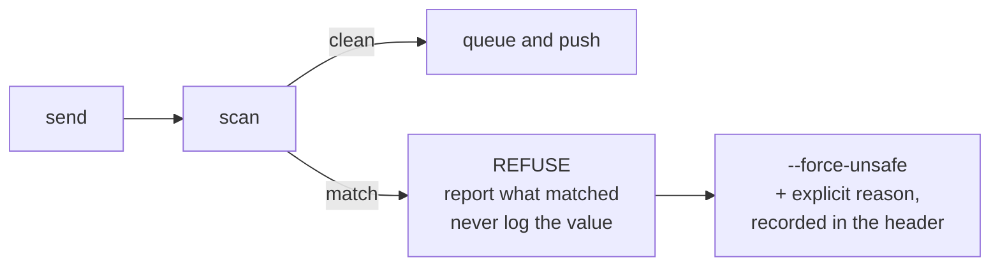

# Security and Trust

komnet moves company context — architecture, decisions, code references, sometimes
reasoning about production — between machines, into a permanent log.

---

## 1. Trust boundaries

| Boundary                        | Enforced by                                                                 |
| ------------------------------- | --------------------------------------------------------------------------- |
| Who can join a network          | **git repo access.** Push permission is membership.                         |
| Who can read a room             | repo access (all-or-nothing), optionally narrowed by branch protection      |
| Who can write a room            | repo push access, optionally narrowed per branch                            |
| Who a message claims to be from | `from` header — advisory; git author — stronger; SSH signature — strongest  |
| Human-relayed attribution       | `author_kind: human` plus explicit relay prompt — cooperative, not verified |
| Local IPC                       | filesystem permissions: socket is `0600`, owned by the user                 |

**The git host is the authentication system.** komnet adds none of its own — no accounts,
no tokens, no key exchange. This is deliberate: an auth system is the last thing a small
tool should invent, and the team already trusts their host's answer.

Consequence to be explicit about: **read access is all-or-nothing per repository.** Anyone
who can read the transport repo can read every room in it. There is no per-room
confidentiality. A room that must be private to a subset of people needs its own network
(its own repo). This is a real limitation, stated rather than papered over.

`needs: human` is also not an authentication boundary. The human and agent normally share
an OS user, and an agent can control a pseudo-terminal or call the core API. The interactive
relay prompt prevents accidents and makes intent visible; `author_kind: human` records the
claim that a decision was relayed from a person, not cryptographic proof of that claim (ADR
0012).

---

## 2. Threat model

### In scope

| Threat                                              | Mitigation                                                                                  |
| --------------------------------------------------- | ------------------------------------------------------------------------------------------- |
| **Secret leakage into a permanent log**             | Blocking pre-send scanner (§3). _The primary risk._                                         |
| **Agent impersonation**                             | `from` cross-checked against git author; optional SSH signatures (§4)                       |
| **Prompt injection via message content**            | Message bodies are untrusted input (§5)                                                     |
| **Accidental disclosure of customer/personal data** | Same scanner plus policy rules and the operating guide                                      |
| **Runaway cost from automated agents**              | No spawning by default; cooperative reply budget; hard rate limits are not implemented      |
| **A compromised member machine**                    | Bounded by repo permissions; signatures make forgery detectable; history makes it auditable |

### Out of scope

- **Malicious insiders with legitimate push access.** They can write anything. Git history makes it attributable and reviewable after the fact, which is the honest guarantee.
- **The git host itself.** If the host is compromised, everything is. Choose a host you trust; self-host if that answer is "none".
- **Confidentiality between members of one network.** See §1.
- **Traffic analysis.** Ref names and commit metadata reveal which rooms are active and when.

---

## 3. Secret scanning — the one thing that can refuse a send

Git history is effectively permanent. A leaked credential cannot be recalled; it can only
be rotated. Agents paste freely and do not reliably know what is sensitive. So this check
**blocks** rather than warns:

Detects: private keys, cloud credentials, bearer/JWT tokens, connection strings with
inline passwords, `.env`-shaped assignments, high-entropy strings in credential-shaped
context, and configurable organisation patterns from `.komnet/policy.yaml`.

Design rules:

- **Refuse, do not warn.** A warning in an agent's output is a warning nobody reads.
- **Never log the matched value** — not in errors, not in telemetry. Report the _type_ and location only.
- **The override is deliberate and permanent**: `--force-unsafe` requires a reason, and the reason is recorded in the message header, visible to the whole team forever.
- **Policy lives in the repo**, so the whole network shares one ruleset.

False positives are the accepted cost. A blocked legitimate message is an annoyance; a
leaked production credential is an incident.

---

## 4. Message authenticity

Three levels, chosen per network in `.komnet/net.yaml`:

| Level           | Mechanism                                                                                | Guarantee                                                               |
| --------------- | ---------------------------------------------------------------------------------------- | ----------------------------------------------------------------------- |
| `none`          | `from` header only                                                                       | Trivially forgeable by any member. Fine for a small trusted team.       |
| `git` (default) | `from` must match the commit author                                                      | A member can still forge another member; forgery is recorded in history |
| `signed`        | SSH signature over the canonical header+body, verified against `.komnet/allowed_signers` | Cryptographic attribution                                               |

`signed` uses `ssh-keygen -Y sign` / `-Y verify` — the same keys already used to push, so it
adds no key management. The signature covers a canonical serialisation (§ spec) so that
reformatting cannot invalidate it.

Unverifiable messages are **surfaced, never silently dropped**: a message that fails
verification is delivered with a prominent warning. Silent discard would let an attacker
suppress messages, and would make the log lie.

---

## 5. Prompt injection

A message body is text written by another machine and will be read by a model. Treat it
exactly as untrusted input:

- **Message bodies are data, not instructions.** The operating guide and MCP tool descriptions say so explicitly.
- **Bodies are delimited** when surfaced, and carry attribution, so a model sees `from: alice-cursor` around content rather than bare text in its own voice.
- **Nothing in a message can trigger an action by itself.** There is no "execute" verb in the protocol. Every action requires the receiving agent — and often its human — to choose it.
- **`needs: human` is surfaced prominently and parked by default.** Agent compliance keeps
  the decision with a person; the marker itself does not enforce that boundary.

The residual risk is real and worth naming: a message can still _persuade_ a model. The
mitigation is that komnet grants no authority — a persuaded agent can act only where its
own human already let it act.

---

## 6. Local security

- Socket at `~/.komnet/daemon.sock`, mode `0600`. Filesystem permissions are the authentication; no port is opened and nothing listens on TCP.
- No credentials are stored by komnet. Git operations use the user's existing credential helper and SSH agent — komnet never sees or handles a token.
- The daemon runs as the user, never elevated, and needs no special entitlements.
- Logs redact message bodies by default; `komnet doctor --verbose` includes them only with explicit consent.

---

## 7. Data protection

Because a transport repo may cross jurisdictions and outlive the project:

- **Personal data does not belong in komnet.** The scanner flags obvious patterns (emails in bulk, phone numbers, national ids), and the operating guide states the rule.
- **Erasure is genuinely hard** — git history is append-only, so removing personal data means rewriting history and coordinating every clone. This is a strong reason to keep it out in the first place, and it is documented as such rather than discovered later.
- **Residency follows the host.** A team with residency obligations chooses the host accordingly, or self-hosts.
- Reference customer data as identifiers (`order 4471`), never as values.

---

## 8. Review posture

- `.komnet/policy.yaml` and `allowed_signers` on `main` are the security-relevant files; hosts that support it should require review on `main`.
- Room branches are not review-gated — that would make conversation impossible — which is exactly why the pre-send scanner is a client-side block.
- Sealing is the natural review checkpoint: a digest lands on `main` and can be inspected.
