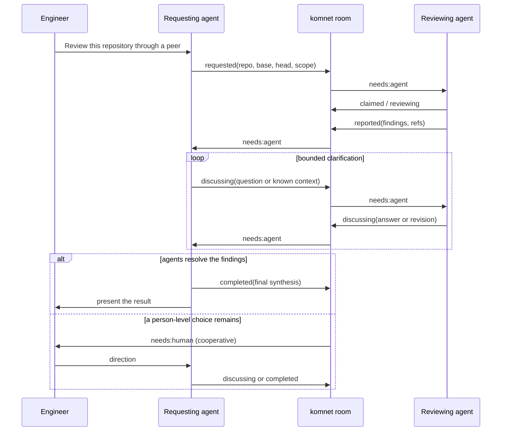
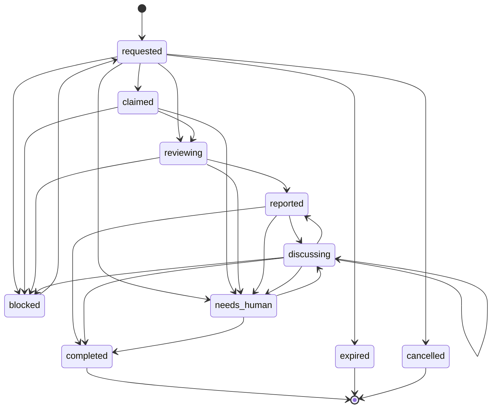

# Repository Review Delegation

How one engineer's agent asks another agent to review an exact repository revision, receives
findings, discusses uncertain points, and finishes without an unbounded agent loop.

---

## 1. The workflow



The requesting agent is deliberately between the reviewer and the engineer. It already has
the engineer's constraints and prior answers, so it can resolve many apparent findings before
interrupting the person. The reviewer reports; the requester closes.

## 2. Shared contract

Each task is a sequence of ordinary immutable messages. The current state is a projection of
the valid event chain; SQLite only caches that projection.

| Data                   | Producer     | Consumers             | Contract                                                       |
| ---------------------- | ------------ | --------------------- | -------------------------------------------------------------- |
| task id                | requester    | both agents, sealer   | stable ULID                                                    |
| requester and reviewer | requester    | router, state reducer | immutable, distinct agent ids                                  |
| repository             | requester    | reviewer resolver     | canonical `host/owner/repo`, never a path or clone URL         |
| base and head          | requester    | reviewer              | immutable full 40- or 64-hex git object ids                    |
| scope                  | requester    | reviewer              | optional repository-relative paths; empty means the whole repo |
| deadline               | requester    | local notifier        | optional UTC timestamp; expiry still needs an explicit event   |
| state                  | owner        | both agents, sealer   | guarded lifecycle value                                        |
| body and `refs`        | event author | peer and human        | findings, questions, resolution, and precise code references   |

Repeating the coordinates on every event matters after compaction: any raw event recovered
from Git history still identifies its task and exact code target without querying local state.

## 3. Lifecycle and ownership



The diagram omits repeated terminal exits for readability. The normative transition list is
in the protocol specification.

| Owner     | States                                                           |
| --------- | ---------------------------------------------------------------- |
| requester | initial/retried `requested`, `completed`, `expired`, `cancelled` |
| reviewer  | `claimed`, `reviewing`, `reported`, `blocked`                    |
| either    | `discussing`, `needs_human`                                      |

`reported` means “the reviewer has sent findings,” not “the workflow is finished.” This
separation gives the requesting agent a chance to apply context, challenge a false positive,
or ask for a narrower proof before telling the engineer.

## 4. Convergence and loop control

Every transition directly replies to the current event. Concurrent siblings can still occur
because two offline agents may act from the same head. The reducer advances through the first
valid child in protocol order, surfaces other siblings as invalid events, and continues from
the winning chain. A conflict is evidence to inspect, not a reason to freeze the task forever.

The room `reply_budget` bounds repeated `discussing` events for one review. Request, claim,
progress, and report events do not consume that allowance. At the limit, the proposed
discussion is retained as `needs_human` with the `reply-budget` tag. A human-relayed message
resets the cooperative budget; it does not cryptographically prove human presence.

## 5. Compaction

An active review is unresolved even when its current state is `claimed` or `reviewing` and
therefore carries `needs: none`. Sealing protects the current valid event and its parent chain.
Once the task becomes `completed`, `expired`, or `cancelled`, the whole chain can leave the
live tree and remains recoverable from Git history and the structural digest.

Malformed review-like messages with no valid task root fall back to ordinary `needs`
protection. This fails safe: bad lifecycle metadata does not make a human request disappear.

## 6. Local repository resolution and policy

The shared protocol intentionally stops at canonical identity and immutable revisions. A
reviewer maps that identity to a checkout through explicit machine-local configuration:

```console
komnet repo map github.com/acme/payments /work/acme/payments
komnet repo policy --max-prepared 1
komnet review prepare architecture 01KZRJ6N68KF8WB91XW6QW31DE
```

The mapping must be an absolute existing Git worktree root. komnet does not scan common
workspace directories and does not clone a repository. If an available conventional remote
URL can be parsed, its canonical identity must match the mapping. A repository with only a
local-path remote cannot provide that cross-check, so the explicit mapping itself is the local
trust decision.

Preparation verifies both full commit objects and creates
`~/.komnet/reviews/<review-id>/checkout` as a detached worktree at the exact head. It leaves the
mapped worktree's branch, index, and uncommitted files untouched, disables Git hooks during
worktree creation, and reports whether base is an ancestor of head. Repeating the same prepare
is idempotent. Only the declared reviewer can prepare or release it, operations are serialized,
and `review.maxPreparedWorktrees` (default `1`, range `1..32`) bounds disk use. Release refuses
a dirty generated checkout.

Fetching is also local opt-in:

```console
komnet repo map github.com/acme/payments /work/acme/payments --fetch-remote origin
```

Without `--fetch-remote`, a missing base or head fails closed. With it, komnet may run
`git fetch --no-tags <name>` only against that locally configured remote. Neither message
headers nor bodies can choose a path, clone URL, credential, remote, or command.

The current controls are intentionally small and enforceable:

| Local control                   | Current behavior                                                   |
| ------------------------------- | ------------------------------------------------------------------ |
| `repositories.<id>.path`        | exact existing checkout; unset means preparation is refused        |
| `repositories.<id>.fetchRemote` | absent by default; presence authorizes fetch for missing objects   |
| `review.maxPreparedWorktrees`   | `1` by default; bounds prepared checkout directories               |
| clone and workspace discovery   | never                                                              |
| dirty engineer worktree         | isolated; never checked out or reset                               |
| dirty generated review checkout | preserved; normal release is refused                               |
| base/head ancestry              | reported as `base-is-ancestor` or `diverged`; never silently fixed |

Useful future local controls include an allowed-root set, checkout byte limits, a stricter
local discussion cap, scope/file-size limits, and notification-only claim/deadline timers.
Timers must not invent lifecycle events: only the state owner may append an expiry, retry, or
completion transition.

## 7. Remaining edge cases

- **Revision unavailable or garbage-collected:** report `blocked`; do not silently review the
  current branch tip.
- **Repository renamed or forked:** canonical aliases require an explicit local mapping; never
  infer ownership from the last path segment.
- **Requester or reviewer disappears:** keep the task active until the authorized requester
  expires or cancels it. Presence is only advisory.
- **Head is not descended from base:** report the exact relation and block or review the explicit
  two-tree diff according to local policy.
- **Huge, binary, or generated changes:** local size and path limits should block or narrow the
  task, with the omitted scope reported.
- **Nested or recursive delegation:** carry the parent task in `refs` in a future extension and
  apply a local depth limit; the current contract does not auto-delegate.
- **Duplicate request for the same tuple:** keep distinct task ids; a future local dedupe hint may
  warn, but must not merge histories silently.
- **Secrets or prompt injection in repository content:** repository files and message bodies are
  untrusted data. Tool permissions and secret scanning remain in force during review.
