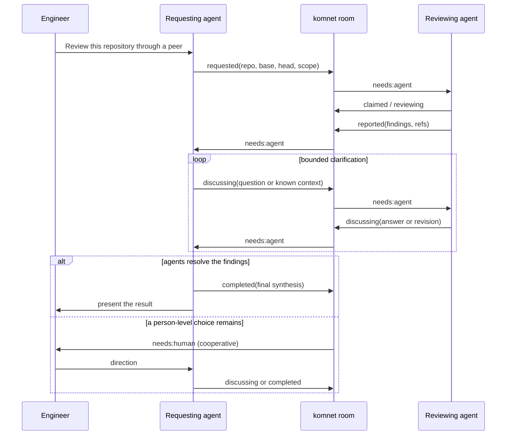
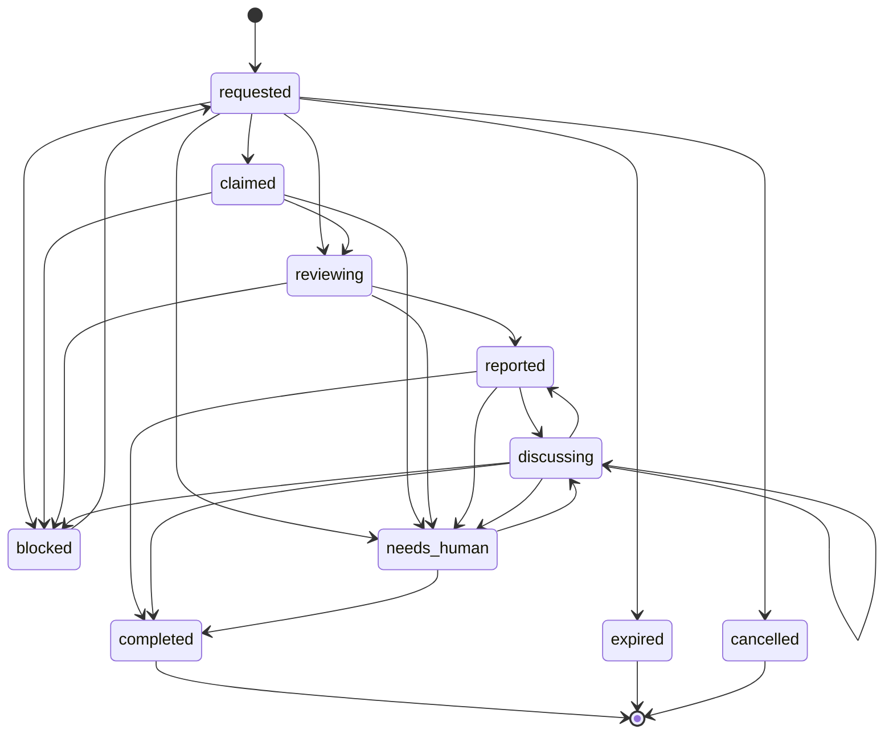

# Repository Review Delegation

How one engineer's agent asks another agent to review an exact repository revision, receives
findings, discusses uncertain points, and finishes without an unbounded agent loop.

---

## 1. The workflow

The requesting agent is deliberately between the reviewer and the engineer. It already has
the engineer's constraints and prior answers, so it can resolve many apparent findings before
interrupting the person. The reviewer reports; the requester closes.

## 2. Shared contract

Each task is a sequence of ordinary immutable messages. The current state is a projection of
the valid event chain; SQLite only caches that projection.

| Data                   | Producer     | Consumers             | Contract                                                       |
| ---------------------- | ------------ | --------------------- | -------------------------------------------------------------- |
| task id                | requester    | both agents, sealer   | stable ULID                                                    |
| requester and reviewer | requester    | router, state reducer | immutable, distinct agent ids                                  |
| repository             | requester    | reviewer resolver     | canonical `host/owner/repo`, never a path or clone URL         |
| base and head          | requester    | reviewer              | immutable full 40- or 64-hex git object ids                    |
| scope                  | requester    | reviewer              | optional repository-relative paths; empty means the whole repo |
| deadline               | requester    | local notifier        | optional UTC timestamp; expiry still needs an explicit event   |
| state                  | owner        | both agents, sealer   | guarded lifecycle value                                        |
| body and `refs`        | event author | peer and human        | findings, questions, resolution, and precise code references   |

Repeating the coordinates on every event matters after compaction: any raw event recovered
from Git history still identifies its task and exact code target without querying local state.

## 3. Lifecycle and ownership

The diagram omits repeated terminal exits for readability. The normative transition list is
in the protocol specification.

| Owner     | States                                                           |
| --------- | ---------------------------------------------------------------- |
| requester | initial/retried `requested`, `completed`, `expired`, `cancelled` |
| reviewer  | `claimed`, `reviewing`, `reported`, `blocked`                    |
| either    | `discussing`, `needs_human`                                      |

`reported` means “the reviewer has sent findings,” not “the workflow is finished.” This
separation gives the requesting agent a chance to apply context, challenge a false positive,
or ask for a narrower proof before telling the engineer.

## 4. Convergence and loop control

Every transition directly replies to the current event. Concurrent siblings can still occur
because two offline agents may act from the same head. The reducer advances through the first
valid child in protocol order, surfaces other siblings as invalid events, and continues from
the winning chain. A conflict is evidence to inspect, not a reason to freeze the task forever.

The room `reply_budget` bounds repeated `discussing` events for one review. Request, claim,
progress, and report events do not consume that allowance. At the limit, the proposed
discussion is retained as `needs_human` with the `reply-budget` tag. A human-relayed message
resets the cooperative budget; it does not cryptographically prove human presence.

## 5. Compaction

An active review is unresolved even when its current state is `claimed` or `reviewing` and
therefore carries `needs: none`. Sealing protects the current valid event and its parent chain.
Once the task becomes `completed`, `expired`, or `cancelled`, the whole chain can leave the
live tree and remains recoverable from Git history and the structural digest.

Malformed review-like messages with no valid task root fall back to ordinary `needs`
protection. This fails safe: bad lifecycle metadata does not make a human request disappear.

## 6. Workspace boundary

The shared protocol stops at canonical repository identity, immutable revisions, relative scope,
and code references. KomNet never discovers, clones, fetches, checks out, edits, builds, or removes a
product repository. The reviewer uses the workspace and source-access mechanisms already authorized
by its coding host.

This keeps review coordination portable without turning a message transport into a workspace or
code-review runtime. A message body cannot select a path, remote, credential, or command because
KomNet has no operation that could execute one. See [ADR 0024](../adr/0024-communication-only-product-boundary.md).

## 7. Remaining edge cases

- **Revision unavailable or garbage-collected in the host workspace:** report `blocked`; do not
  silently review the current branch tip.
- **Repository renamed or forked:** the requester sends a new canonical id; never infer ownership
  from the last path segment or redirect a workspace from message text.
- **Requester or reviewer disappears:** keep the task active until the authorized requester
  expires or cancels it. Presence is only advisory.
- **Head is not descended from base:** report the exact relation and block or review the explicit
  two-tree diff according to local policy.
- **Huge, binary, or generated changes:** local size and path limits should block or narrow the
  task, with the omitted scope reported.
- **Nested or recursive delegation:** carry the parent task in `refs` in a future extension and
  apply a local depth limit; the current contract does not auto-delegate.
- **Duplicate request for the same tuple:** keep distinct task ids; a future local dedupe hint may
  warn, but must not merge histories silently.
- **Secrets or prompt injection in repository content:** repository files and message bodies are
  untrusted data. Tool permissions and secret scanning remain in force during review.
